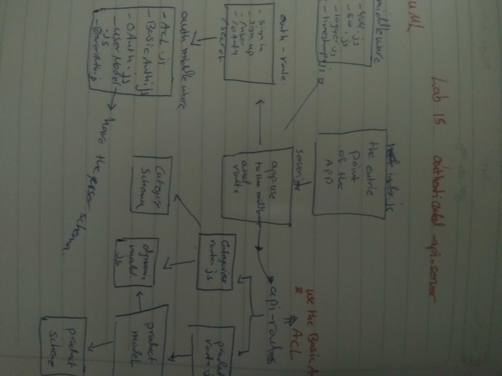

# lab15
# authentication-api-server
Author:
mai yousef 

## Links and Resources
submission PR https://github.com/401-advanced-javascript-Mai/lab15/pulls

ci/cd https://github.com/401-advanced-javascript-Mai/lab15/actions

## How to initialize/run your application (where applicable)
npm run start , node index.js

## Tests How do you run tests?
no test

## .env
PORT=3000 MONGOOSE_URI=mongodb://localhost:27017/authdb SECRET=COOLMAI CLINENT_ID=1aee4b1ac779e29bdc8c CLINENT_SECRET=478787e62360c652af33a2cdd26420b8619325f7 API_SERVER=http://localhost:3000/oauth

## UML
